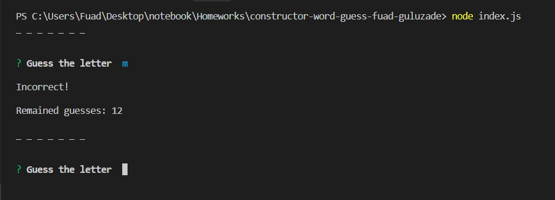

# constructor-word-guess-fuad-guluzade
Put one letter in a time.
For a each word you have 13 wrong tries.
If you try to guess letter which you were previously guessed, program won't accept it. You have to delete and put different one.
If you find the word or out of tries, program will offer you to play a new game. Overall, each game session consists 3 words.
If you refused to play or game session ends, program will display you wins and loses.
